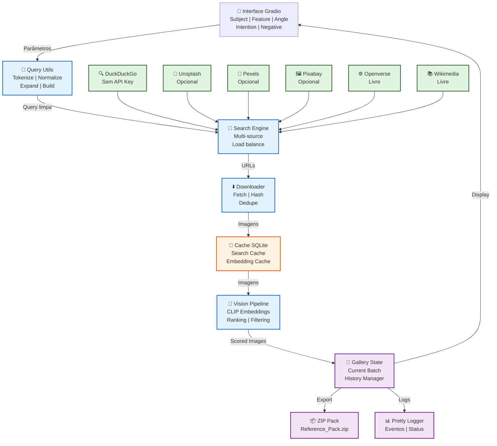

# Visual Study Tool

Ferramenta de referência visual para artistas e designers. Busca imagens em múltiplas fontes, faz download, classifica usando CLIP e exporta uma galeria limpa para estudo.

## Funcionalidades

- 🔍 **Busca multi-fonte** - DuckDuckGo, Unsplash, Pexels, Pixabay, Openverse, Wikimedia
- 🤖 **Ranking com CLIP** - Classifica imagens por similaridade semântica
- 📊 **Pesos por fonte** - Controla quanto cada fonte contribui nos resultados
- 📦 **Download em lotes** - Gerencia histórico com deduplicação
- 💾 **Cache inteligente** - SQLite para buscas e embeddings
- ➕ **Carregar mais** - Continua buscando sem reiniciar a app
- 📥 **Exportar ZIP** - Lote atual ou todo histórico
## Arquitetura



## Estrutura

```
visual-studio-tool
├── app.py                 # Entrada principal
├── config/
│   ├── settings.py       # Constantes e configuração
│   ├── presets.py        # Valores padrão
│   └── ui_options.py     # Opções de UI
├── core/
│   ├── search_engine.py  # Engines de busca (abstração)
│   ├── downloaders.py    # Download de imagens
│   ├── vision_pipeline.py # Pipeline CLIP (ranking)
│   ├── search_pipeline.py # Orquestração da busca
│   └── query_utils.py    # Processamento de texto
├── ui/
│   ├── layout.py         # Layout Gradio
│   └── components.py     # Componentes reutilizáveis
├── utils/
│   ├── search_cache.py   # Cache SQLite de buscas
│   ├── embedding_cache.py # Cache de embeddings CLIP
│   ├── image_utils.py    # Processamento de imagens
│   ├── file_utils.py     # Utilitários de arquivo
│   └── pretty_logger.py  # Logging colorido
├── tests/
│   ├── conftest.py       # Fixtures compartilhadas
│   ├── test_*.py         # 164 testes unitários
│   └── test.py           # Smoke tests
├── ui.css                # Estilos (nova paleta azul marinho)
└── requirements.txt      # Dependências
```

## Instalação

### Requisitos
- Python 3.10+
- pip

### Setup

```bash
# Clonar repositório
git clone https://github.com/seu-usuario/visual-study-tool.git
cd visual-study-tool

# Criar ambiente virtual
python -m venv venv
source venv/bin/activate  # Windows: venv\Scripts\activate

# Instalar dependências
pip install -r requirements.txt
```

## Configuração

Crie um arquivo `.env` na raiz do projeto. Todos os valores são opcionais:

```bash
# Engines de busca (ativadas por padrão)
ENABLE_MULTI_ENGINE=true
ENABLE_DDG=true
ENABLE_OPENVERSE=true
ENABLE_WIKIMEDIA=true

# APIs opcionais (deixe vazio se não usar)
UNSPLASH_ACCESS_KEY=
PEXELS_API_KEY=
PIXABAY_API_KEY=

# Performance
SEARCH_POOL_SIZE=120
DOWNLOAD_BATCH_SIZE=60
DISPLAY_BATCH_SIZE=60
MAX_GALLERY_ITEMS=180

# Scoring
BASE_SIMILARITY_THRESHOLD=0.18
INTEGRITY_MARGIN=0.02
INTEGRITY_MIN_KEEP=12

# Log
LOG_LEVEL=INFO
```

Use `.env.example` como referência.

## Como usar

```bash
python app.py
```

A app abre automaticamente no navegador em `http://localhost:7860`.

### Fluxo típico

1. **Subject** - O que você quer buscar (ex: "wolf knight")
2. **Feature** (opcional) - Detalhe ou pose (ex: "side profile")
3. **View Angle** (opcional) - Ângulo da câmera (ex: "front", "3/4")
4. **Intention** - Selecione o estilo (fotografia, concept art, etc)
5. **Negative** (opcional) - O que evitar (ex: "blurry, watermark")
6. **Buscar** - Inicia a busca
7. **Load More** - Carrega mais resultados
8. **Download** - Exporta como ZIP

## Testes

### Testes unitários

164 testes automatizados cobrindo toda lógica:

```bash
# Todos os testes
python -m pytest tests/ --ignore=tests/test.py -v

# Teste específico
python -m pytest tests/test_query_utils.py -v

# Com cobertura
python -m pytest tests/ --ignore=tests/test.py --cov=core --cov=utils
```

**Cobertura:**
- Query utils (52 testes)
- Image utils (31 testes)
- File utils (20 testes)
- Cache (19 testes)
- Search engine (25 testes)
- Vision pipeline (17 testes)

### Smoke tests (com rede real)

```bash
python tests/test.py
```

Usa chamadas reais de rede. Pode variar se uma fonte estiver com rate limit.

### Cores principais

- Fundo: `#06091a` (azul escuro)
- Accent: `#2a7ef5` (azul elétrico)
- Texto: `#edf2fc` a `#5a7596` (gradação)

## Performance

### Primeira execução

- Baixa modelos CLIP (~2-3 minutos)
- Cria cache SQLite

### Buscas subsequentes

- Cache acelera buscas conhecidas
- Embeddings reutilizados da cache

### Memória

- Gallery capped em `MAX_GALLERY_ITEMS`
- Arquivos antigos removidos automaticamente
- Histórico de batch limitado

## Observações

- **Primeira vez é lenta** - CLIP precisa ser baixado (modelos ~500MB)
- **APIs pagas são opcionais** - Funciona com fontes grátis por padrão
- **Sem dependências pesadas** - Usa bibliotecas leves e acessíveis
- **Extensível** - Fácil adicionar novos engines de busca

---
**Desenvolvido por [Eduardo Lima]** | [GitHub](https://github.com/eduardo-ebdl) | [LinkedIn](https://www.linkedin.com/in/eduardoebdl/)
